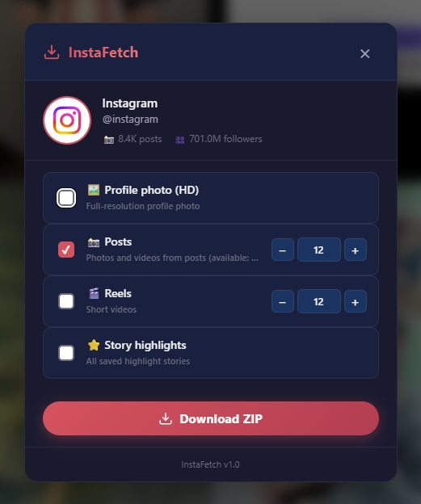

# InstaFetch

InstaFetch is a lightweight Chrome extension that allows you to download Instagram profile pictures and posts (photos and videos) with ease.

## Features

- **Download Profile Pictures:** A floating "InstaFetch" button appears on profile pages to download the full-size profile picture.
- **Download Posts:** A "Download post" button appears directly on single post pages and modals.
- **Automatic ZIP Packaging:** When downloading posts with multiple items (carousels), they are automatically bundled into a single ZIP file.
- **English UI:** Fully translated interface for ease of use.
- **Smart Fallback:** Uses both Instagram API and DOM scraping to ensure reliable downloads even when the API returns errors.

## Installation

1. Download the `InstaFetch.zip` from the [Releases](https://github.com/808StaN/InstaFetch/releases) page.
2. Unzip the file to a folder on your computer.
3. Open Google Chrome and navigate to `chrome://extensions/`.
4. Enable **Developer mode** in the top right corner.
5. Click **Load unpacked** and select the folder where you unzipped the extension.

## Usage

- **On a Profile:** Click the floating "InstaFetch" button above the "Message" button.
- **On a Post:** Click the "Download post" button located near the interaction icons.

## Disclaimer

Please use this tool responsibly and respect the privacy and copyrights of content creators on Instagram.
